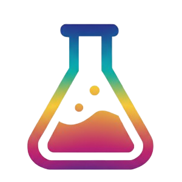

<h1 align="center">
  <br>
  
  <br>
  Try 
  <br>
</h1>

> “*Be happy for this moment. This moment is your life.*” — *[Omar Khayyam](https://en.wikipedia.org/wiki/Omar_Khayyam)*

Collection of tools for experimenting with libraries with minimum effort.

## Requirement

These are collection of [Yeoman](https://yeoman.io/) generators. You can install it by:

```bash
npm install -g yo
```

Then you can install any generators including below to use try:

```bash
npm install -g generator-try-nodejs
```

Look into each generator repository readme, to see how each work, but if you're familiar with one others should be similar.

## Generator

- [try-nodejs](https://github.com/webvv/generator-try-nodejs)
- [try-typescript](https://github.com/webvv/generator-try-typescript)
- [try-fpts](https://github.com/webvv/generator-try-fpts)
- [try-effect](https://github.com/webvv/generator-try-effect)